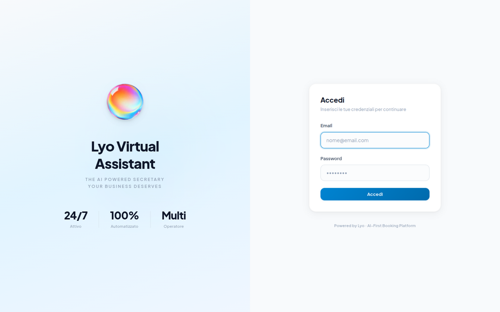
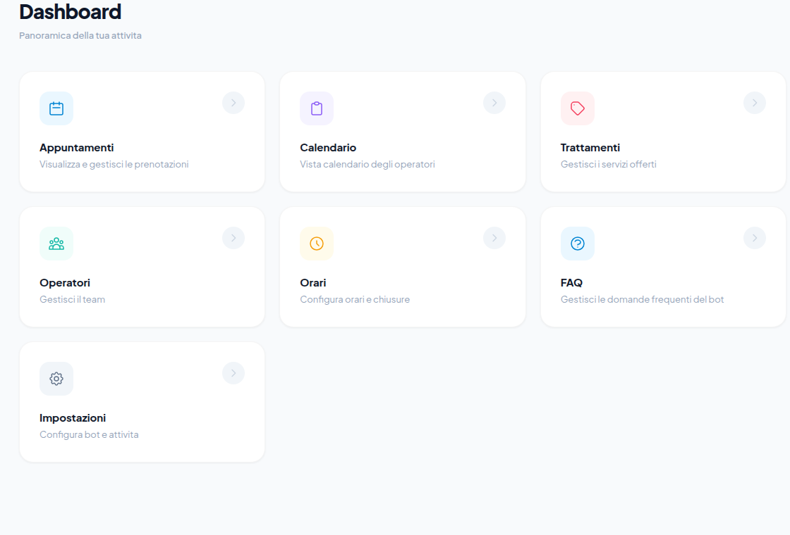
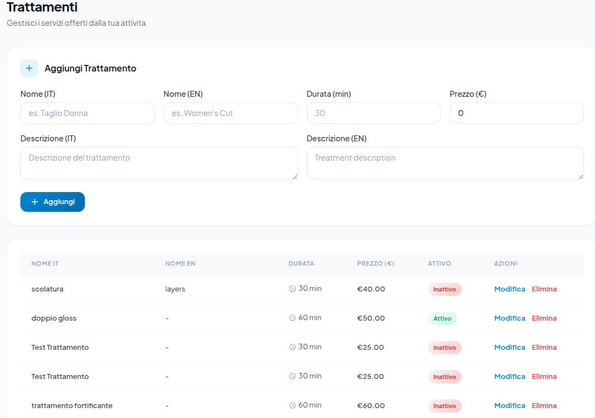
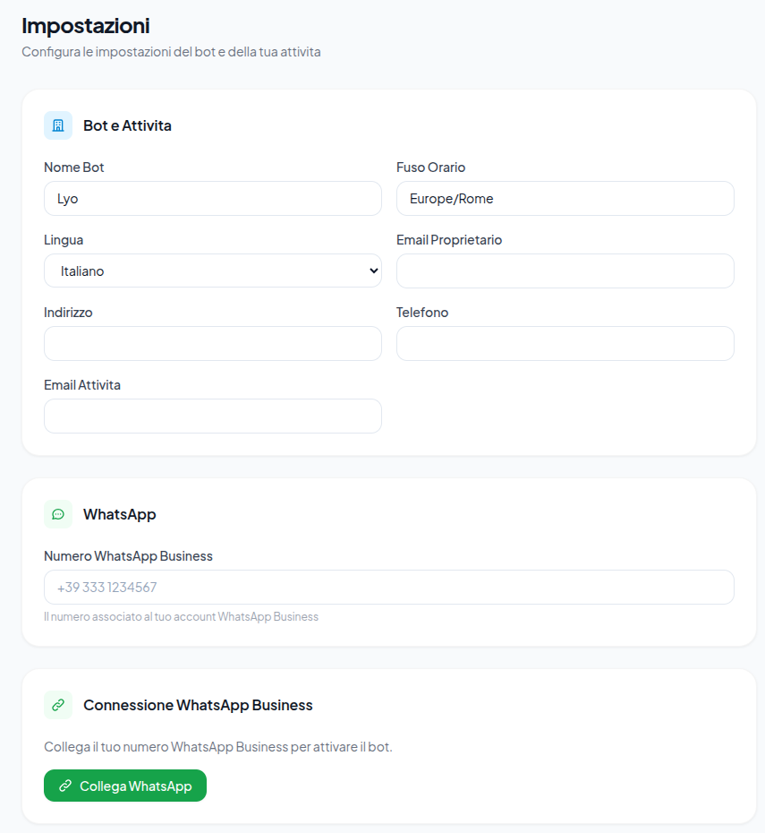
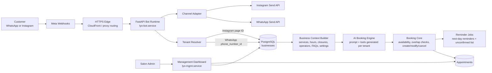
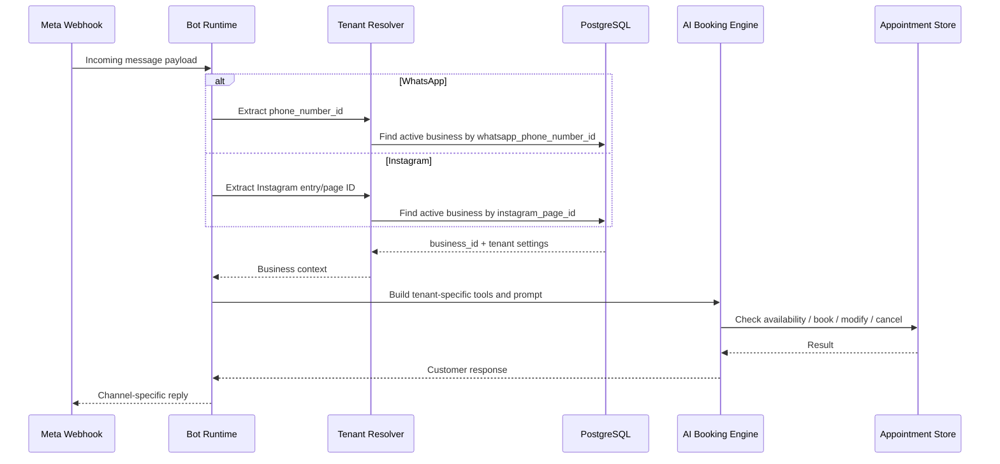

  

<h1 align="center">Lyo Virtual Assistant</h1>

  A configuration-driven, multi-tenant AI booking platform for salons.
  One shared runtime. Many businesses. Different channels, teams, calendars, services, policies, and workflows without cloning the codebase.

  
  
  
  
  

---

## Executive Snapshot

Lyo started as an Italian appointment assistant and evolved into a sellable multi-tenant SaaS system. Each salon can run its own WhatsApp number, Instagram account, services, operators, hours, closures, FAQs, policies, and management users while sharing the same production bot and dashboard code.

The core idea is simple: tenant configuration lives in PostgreSQL and is loaded at runtime. The bot resolves the correct business at the webhook edge, builds the business-specific prompt/tools/context, and carries `business_id` through routing, booking, availability, calendar views, reminders, and conversation history.

| Capability | What was built | Why it matters |
| --- | --- | --- |
| Multi-tenant routing | WhatsApp routes by `phone_number_id`; Instagram routes by Instagram Business/Page ID | One deployed bot can serve many businesses |
| Configurable control plane | Dashboard for treatments, operators, hours, FAQs, settings, appointments, users | Admins change operations without code changes |
| AI booking engine | Natural-language booking, modification, cancellation, availability checks, FAQs | Customers interact conversationally, not through forms |
| Operator-aware scheduling | Services map to eligible operators; availability checks operator capacity and time overlap | Prevents invalid bookings as teams scale |
| Cross-channel runtime | WhatsApp and Instagram share booking logic with channel-specific send/receive adapters | New channels can be added without forking the business core |
| Production verification | Systemd services, public/internal health checks, focused regression tests | Changes are verified against the real deployed shape |

---

## Product Surface

The management dashboard is intentionally a control plane, not a static admin skin. Its job is to let a business owner change how the assistant behaves.

  

<table>
  <tr>
    <td width="50%">
      
    </td>
    <td width="50%">
      
    </td>
  </tr>
  <tr>
    <td>Configuration modules: appointments, calendar, treatments, operators, hours, FAQ, settings, users.</td>
    <td>Treatments can be changed by admins: name, language labels, duration, price, active state, and descriptions.</td>
  </tr>
</table>

  

---

## Configuration Model

| Admin-configurable surface | Runtime effect |
| --- | --- |
| Business profile | Bot name, timezone, language, public contact details, owner context |
| WhatsApp connection | Incoming webhooks resolve the tenant from the Meta phone number ID |
| Instagram connection | Incoming DMs resolve the tenant from the Instagram Business/Page ID |
| Treatments | Booking tools, customer-facing service list, duration, price, active/inactive availability |
| Operators | Eligible services per operator, operator-aware booking, calendar columns, workload distribution |
| Business hours | Valid booking windows, day-level availability, next-open-date reasoning |
| Closures | Holidays and special closure ranges override normal weekly hours |
| FAQs and policies | The AI can answer tenant-specific questions without changing the prompt code |
| Appointments | Dashboard views, cancellation, move/refetch behavior, status changes |
| Management users | Tenant-scoped dashboard access by authenticated business user |

This is the architectural pattern the project is meant to demonstrate: the customer changes data, not code.

---

## Runtime Architecture

The important boundary is between channel adapters and booking logic. WhatsApp and Instagram differ at ingress/egress, but they converge on the same business context and booking core.

---

## Tenant Resolution

No tenant should silently fall back to a global default. If the webhook cannot be mapped to an active business, the safe behavior is to stop and log the routing miss.

---

## Production-Grade Booking Rules

The system handles more than a happy-path booking form.

| Rule | Why it exists |
| --- | --- |
| Confirm-before-booking | The assistant must not create appointments until the customer explicitly confirms |
| Operator eligibility | A service can only be booked with operators configured to perform it |
| Business hours and closures | Normal hours and special closure ranges both constrain valid slots |
| Customer overlap protection | One customer cannot hold overlapping appointments with different operators |
| Auto-addon support | Certain services can create linked secondary appointments when configured |
| Modify/cancel lookup | The bot first retrieves the customer's future appointments before modifying or cancelling |
| Calendar refetch after moves | The dashboard immediately reloads server state after calendar changes |

Recent focused regression coverage includes customer double-booking prevention across same-time, partial-overlap, and non-overlap cases.

---

## First Fix Architecture Mapping

If I were architecting First Fix, I would use the same principle: one master system, many companies, behavior controlled by tenant configuration.

| First Fix requirement | Reusable architecture I would build | Lyo pattern already demonstrated |
| --- | --- | --- |
| Different pipeline stages | Tenant-owned workflow schema: stages, transitions, required fields, automations | Tenant-owned services/operators/hours drive booking behavior |
| Different terminology | Company vocabulary table powering labels, AI language, UI copy, exports | Italian/English labels and tenant-specific FAQ/policy context |
| Different AI rules | Versioned AI policy pack per tenant: tone, escalation, approval rules, prohibited actions | Business context builder generates prompt/tools per `business_id` |
| Different email/SMS templates | Template registry with variables, preview, audit history, and channel adapters | WhatsApp/Instagram adapters share core logic but send differently |
| Different documents | Document definitions stored as templates with merge fields and workflow triggers | Booking/reminder payloads are generated from runtime data |
| Different cron jobs | Tenant-scoped scheduler: job type, cadence, timezone, enabled flag, retry policy | Multi-business reminder jobs iterate active tenants and timezone context |
| Different integrations | Ports-and-adapters layer: CRM, calendar, SMS, email, accounting, storage | Meta WhatsApp/Instagram are separate adapters over one booking core |
| Five clients at once | Isolated `company_id` everywhere, config promotion workflow, observability by tenant | `business_id` is carried through routing, dashboard, booking, and logs |

The trap is cloning the app five times. The scalable answer is a configurable domain model with strong tenant boundaries, versioned workflow definitions, adapter-based integrations, and tests that prove one company's configuration cannot leak into another company's runtime.

---

## Code Map

| Area | Files to inspect |
| --- | --- |
| Live bot runtime | [`deployed-live/bot/salon_bot_with_booking.py`](deployed-live/bot/salon_bot_with_booking.py) |
| Tenant context loading | [`deployed-live/bot/business_context.py`](deployed-live/bot/business_context.py) |
| Dashboard app | [`lyo-bot/management/app.py`](lyo-bot/management/app.py) |
| Treatment configuration | [`lyo-bot/management/routes/treatments.py`](lyo-bot/management/routes/treatments.py) |
| Operator configuration | [`lyo-bot/management/routes/operators.py`](lyo-bot/management/routes/operators.py) |
| Hours and closures | [`lyo-bot/management/routes/hours.py`](lyo-bot/management/routes/hours.py) |
| FAQ configuration | [`lyo-bot/management/routes/faq.py`](lyo-bot/management/routes/faq.py) |
| Business settings | [`lyo-bot/management/routes/settings.py`](lyo-bot/management/routes/settings.py) |
| Instagram connection | [`lyo-bot/management/routes/instagram.py`](lyo-bot/management/routes/instagram.py) |
| WhatsApp tenant columns | [`lyo-bot/database/migrations/003_whatsapp_api_columns.sql`](lyo-bot/database/migrations/003_whatsapp_api_columns.sql) |
| Instagram tenant columns | [`lyo-bot/database/migrations/007_instagram_columns.sql`](lyo-bot/database/migrations/007_instagram_columns.sql) |
| Double-booking tests | [`tests/test_customer_double_booking.py`](tests/test_customer_double_booking.py) |

---

## AI-Assisted Engineering Workflow

This is how I use Cursor and AI coding tools on a project like this.

1. Understand the existing system first: use semantic search, ripgrep, file tree review, logs, tests, and production context before touching code.
2. Turn the issue into a small hypothesis: identify the exact route, function, table, or runtime boundary involved.
3. Write or update a focused test around the behavior that matters.
4. Implement narrowly inside the current architecture rather than introducing a new abstraction too early.
5. Review generated code like a senior engineer: tenant isolation, data leakage, error paths, idempotency, rollback, and observability.
6. Verify in layers: unit tests, targeted regression tests, health checks, logs, and browser-level checks for dashboard work.
7. Leave durable handoff notes so the next session can continue from evidence, not memory.

Cursor is most valuable when it is treated as an acceleration layer over engineering judgment: fast codebase navigation, controlled edits, refactors, test generation, and review. The human job is still to own the architecture and verify the behavior.

---

## Loom Walkthrough

For a 7-minute application Loom, this repository supports a tight screen-share:

| Time | Show | Point to make |
| --- | --- | --- |
| 0:00-0:30 | Camera intro | Full-stack/AI engineer focused on configurable SaaS systems |
| 0:30-2:15 | Dashboard screenshots and configuration model | Admins change services, operators, hours, FAQs, channels, and settings without code |
| 2:15-3:30 | Runtime architecture diagram | One bot runtime resolves tenant, loads config, builds tenant-specific AI behavior |
| 3:30-5:00 | First Fix mapping table | Same architecture applies to installation companies with different stages, terminology, rules, templates, docs, jobs, and integrations |
| 5:00-6:30 | Cursor/code map | Show how I inspect code, plan, implement, test, debug, and review AI-generated changes |
| 6:30-7:00 | Close | I can own multiple client implementations because the system is built around configuration, tenant isolation, and verification |

---

## Current Status

The branch currently documents and contains the multi-tenant Lyo SaaS evolution:

- WhatsApp and Instagram tenant routing are implemented.
- Dashboard configuration exists for business operations and bot behavior.
- Production bot and dashboard service boundaries are documented in [`docs/codex/PROJECT_CONTEXT.md`](docs/codex/PROJECT_CONTEXT.md).
- The latest double-booking fix was verified in production after an authorized restart.
- Known legacy test-maintenance issues are documented separately and should not be confused with the focused double-booking regression coverage.

For production diagnostics or deployment work, read [`AGENTS.md`](AGENTS.md), [`docs/codex/PROJECT_CONTEXT.md`](docs/codex/PROJECT_CONTEXT.md), and [`docs/codex/AWS_ACCESS.md`](docs/codex/AWS_ACCESS.md) first.
